# Import many images from OSS to Image Search instance

## Summary

1. [Introduction](#introduction)
2. [Prerequisite](#prerequisite)
3. [Step 1 - Prepare an increment.meta file](#Step-1---Prepare-an-incrementmeta-file)
4. [Step 2 - Configure a OSS import setting parameters on Image Search instance](#Step-2---Configure-a-OSS-import-setting-parameters-on-Image-Search-instance)
5. [Step 3 - Execute OSS import](#Step-3---Execute-OSS-import)
5. [Step 4 - Test image search with your images](#Step-4---Test-image-search-with-your-images)
6. [Support](#support)


## Introduction

The goal of this tutorial is to explain how to import a large amount of image files from [OSS](https://www.alibabacloud.com/help/product/31815.htm) to [Image Search](https://www.alibabacloud.com/help/product/66413.htm) instance. OSS is a storage service and Image Search is an intelligent image service based on deep learning and machine learning technology on Alibaba Cloud. This tutorial helps you to prepare a configuration file and some setting parameters to execute OSS import on Image Search instance.


## Prerequisite

### Local environment

* npm
* Node.js

In this tutorial, we use a tool to create a configuration file efficiently. To run it, you have to install [npm](https://github.com/npm/cli) and [Node.js](https://nodejs.org/) on your local machine. Please install them if you don't have.

You can check your environment with the following commands in a terminal:
```bash
# Check that npm is installed
npm -v

# Check that node is installed
node -v
```

### Alibaba Cloud

0. Alibaba Cloud account

    You need an Alibaba Cloud account. If you don't have any account, please follow
    [this document to create one](https://www.alibabacloud.com/help/doc-detail/50482.htm).

1. Create an access key

    You need an accessKeyId and an accessKeySecret. If you don't have any access key, Please follow
    [this document to obtain an access key id and secret](https://www.alibabacloud.com/help/faq-detail/63482.htm).

2. Image Search instance

    You need an image search instance. If you don't have any Image Search instance, please follow [this document to create one](https://www.alibabacloud.com/help/doc-detail/66569.htm).

3. OSS bucket

    You need an OSS bucket which contains image files. If you don't have any OSS bucket with image files, please follow [this document to create one](https://www.alibabacloud.com/help/doc-detail/31886.htm) to upload images. Please note **your Image Search instance and OSS must be in the same region**.


## Step 1 - Prepare an increment.meta file

To import image files from OSS to Image Search instance, you have to create a configuration file called [incremant.meta](https://www.alibabacloud.com/help/doc-detail/66580.htm#h3-import-images). The file contains list of image import task configuration. Each task configuration corresponds to one image. The following parameters are in each task configuration.

* operator: This field specifies the action to be taken on the images. *ADD* means adding new images.
*DELETE* means removing images.

* item_id: It is an identification field for the image and must be unique. For product search, this field means the product ID. For generic search, this field specifies the image name.

* cat_id: It specifies category of the image. For product search, you can select the [category](https://www.alibabacloud.com/help/doc-detail/66623.htm) which the image belongs to. For generic search, the image category is always set to OTHERS, hence this field is useless.

* cust_content: This field specifies the custom content, which is read-only to the system and is displayed in the image search result. You can input any text you want that is releted to the image. For example, a description of the image like "Red dress for women".

* pic_list: It is an array which only contains one image file name. For example, ["sample1.jpg"].

To preapare an increment.meta file easier with the tool, please follow the steps:

1. Clone this repository

2. Build the tool

    First, initialize the tool by running the following commands in a terminal:

    ```bash
    cd tool/app/server
    npm run init
    ```

3. Start a server of the tool

    Then, start a server by running the following command in a terminal:

    ```bash
    npm run start
    ```

4. Use the tool

    1. Access to http://localhost:3000.

    2. Input your credentials to the form.
        * accessKeyId : The access key if of your Alibaba Cloud account
        * accessKeySecret : The access secret if of your Alibaba Cloud account
        * OSS region : The region of your OSS bucket
        * OSS bucket : The name of your OSS bucket
        * OSS bucket folder : the OSS bucket folder path which contains your images. By default, this tool get all images in the specified OSS bucket and put them into the list in increment.meta file. If you want to select an OSS bucket folder to filter the list, you can specify it.

        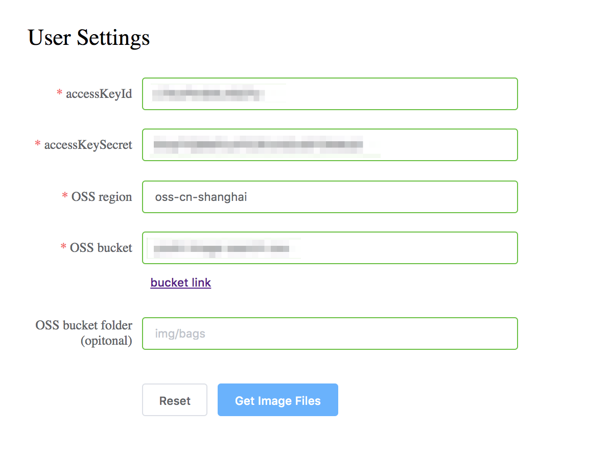

        You can check OSS region and bucket name from [OSS console](https://oss.console.aliyun.com/overview).

        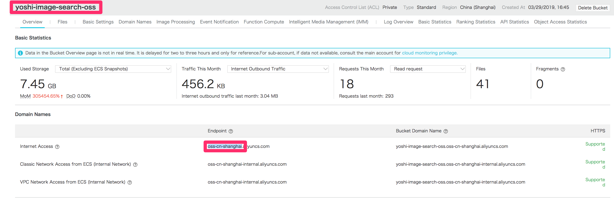

    3. Submit the form to get the image list in your bucket.

    4. Check image list and change the following fields for each image if you need.
        * ID : It corresponds to *item_id* in the increment.meta file.
        * Category : It corresponds to *cat_id* in the increment.meta file.
        * Custom content : It corresponds to *cust_content* in the increment.meta file.

        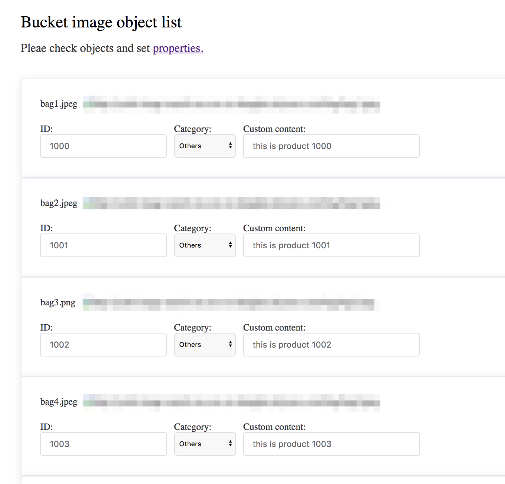

        Please note that because the tool is for OSS import, the field *operator* in the increment.meta file is input as *ADD* and the field *pic_list* in the increment.meta is generated automatically from the image name in OSS.

        To preview your images, you have to set [ACL](https://www.alibabacloud.com/help/doc-detail/100676.htm) of the images to *Public Read* in your OSS setting.

    5. Click a download link at the bottom.

        An increment.meta file will be downloaded.

        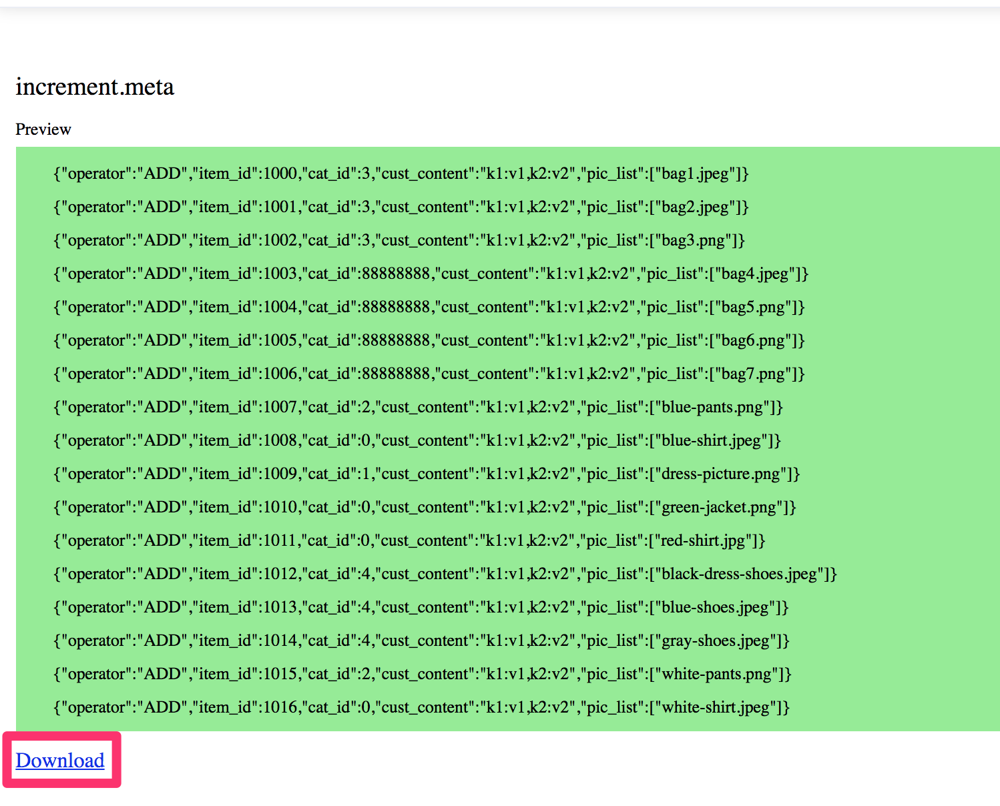

5. Stop the server of the tool

    After you get the increment.meta file, stop the server by press Ctrl + c in a terminal.

6. Put the increment.meta file

    Put the increment.meta file you created at previous step into every OSS bucket folder which contains the images you want to import to Image search instance.

    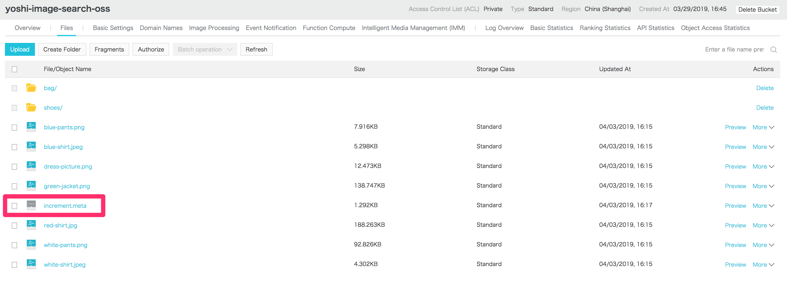

    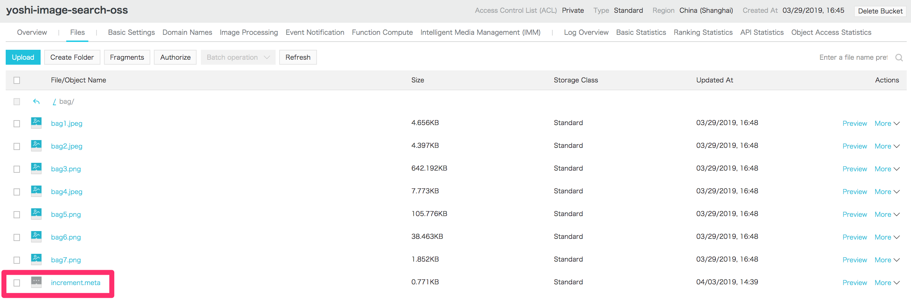


## Step 2 - Configure a OSS import setting parameters on Image Search instance

First, click the *Import* button at top-right corner.

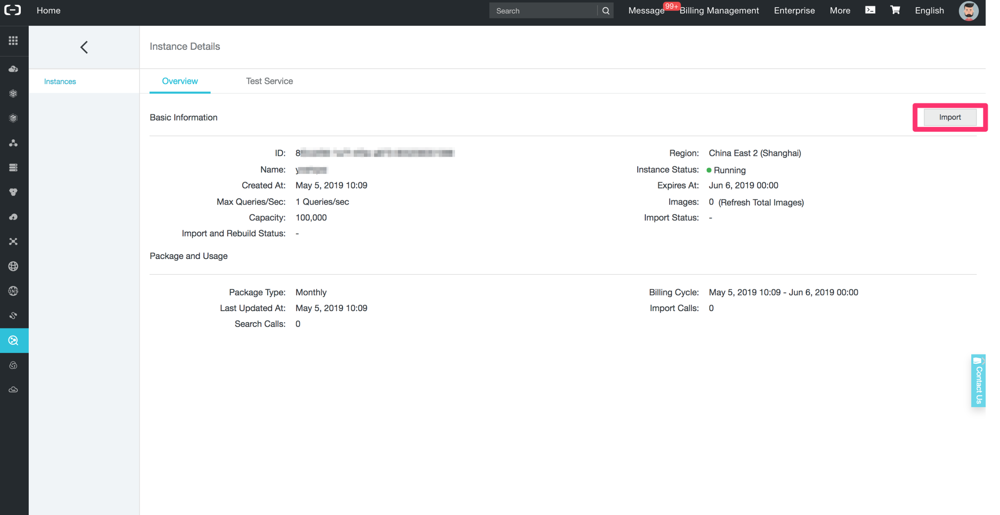

Then, a menu appears which has input boxes of setting parameters for import. You have to prepare them for OSS import.


1. ARN

    You have to give some permissions to the Image Search instance. Create a RAM role and input the ARN parameter as an import setting parameter.

    1. Access to [RAM Roles management console](https://ram.console.aliyun.com/roles).

    2. Create a RAM role.

        1. Click *Create RAM Role* button.

        2. Select a type as **Alibaba Cloud Service** and trusted service as **Image Search**.

            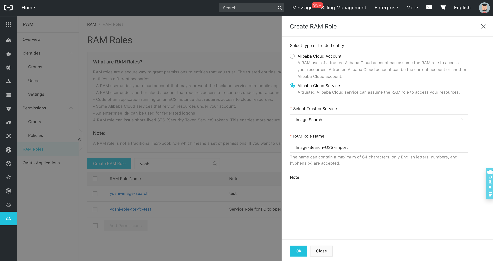

        3. Input a RAM Role Name. For example, "Image-Search-OSS-import".

        4. Click *OK* button.

    3. Add permissions to a RAM role.

        1. Search a RAM role you created and click *Add Permissions* button.

            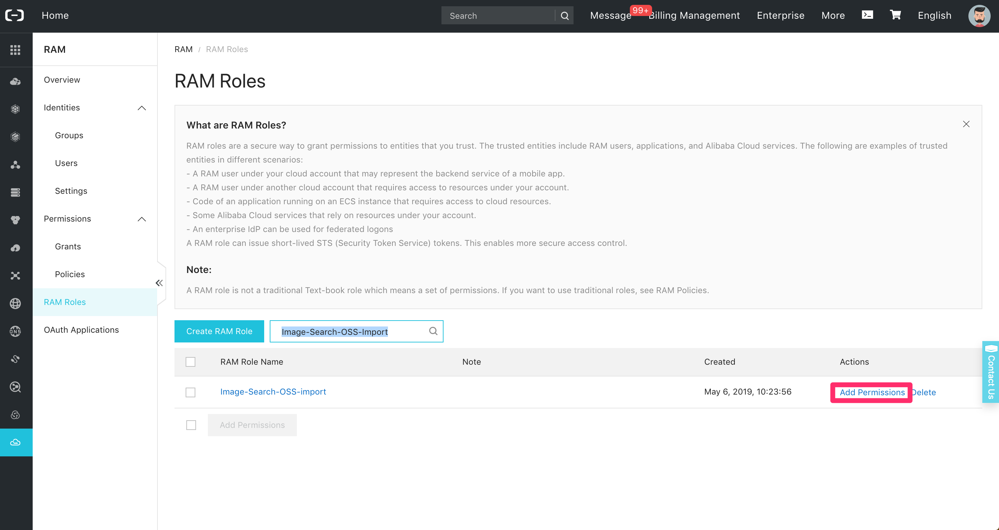

        2. Add Permissions.

            1. Search policy of **AliyunOSSReadOnlyAccess** and select it.

                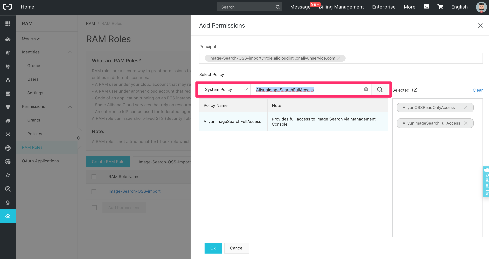

            2. Do same for **AliyunImageSearchFullAccess**.

            3. Click *OK* button.

    4. Get ARN.

        1. Open the role details of a RAM role you created.

            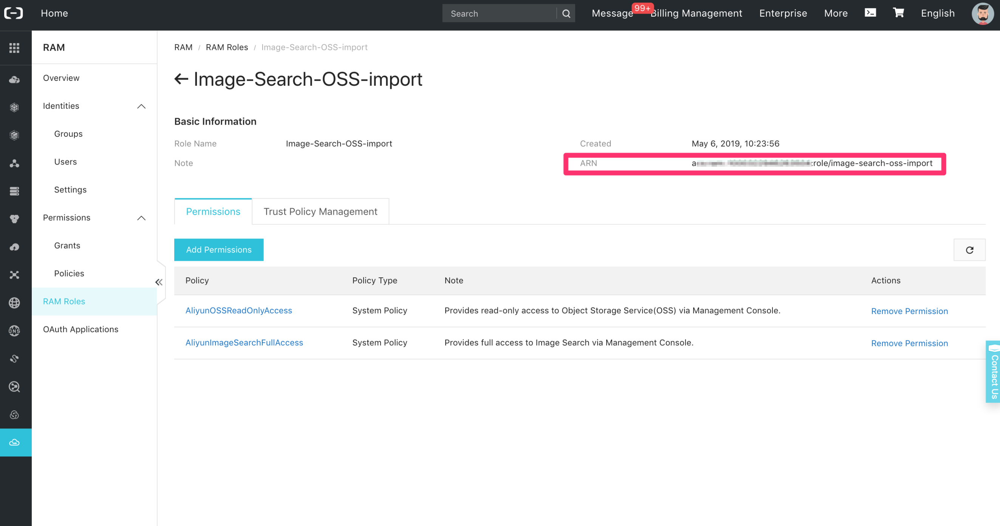

        2. Copy ARN and paste it to ImageSearch instance OSS import parameter input box.

            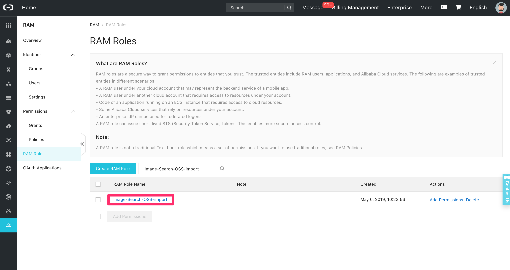

2. Bucket Name

    Check the bucket name which contains your images from [OSS console](https://oss.console.aliyun.com/overview), and input the name as an import setting parameter.

3. Path

    It represents the OSS bucket folder path. Check the bucket folder path which contains your images in your OSS bucket, and input the path as an import setting parameter. It must start with "/", for example "/bag". You have to input "/" if you put your images on root.


## Step 3 - Execute OSS import

After the configuration, click the *Import* button to execute OSS import.

Please note that **OSS import can be executed to only one OSS bucket folder by once**. The images listed in increment.meta file which are not in the specified *Path* will be ignored. If you want to import from multiple folders in OSS bucket, you have to change *Path* parameter and execute for each folder.

After import, you can see your import history by click *Show Import History*.

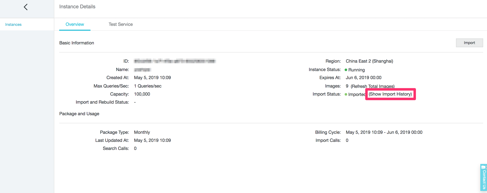


## Step 4 - Test image search with your images

At last, you can test image search with your images imported. Select the tab *Test Searvice*, select an image you want to search, click *Start Test*, and then you can get the result.

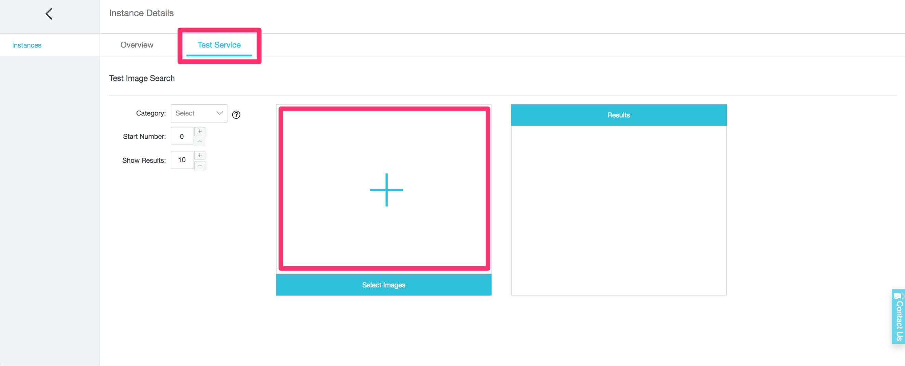


## Support

Don't hesitate to [contact us](mailto:projectdelivery@alibabacloud.com) if you have questions or remarks.
