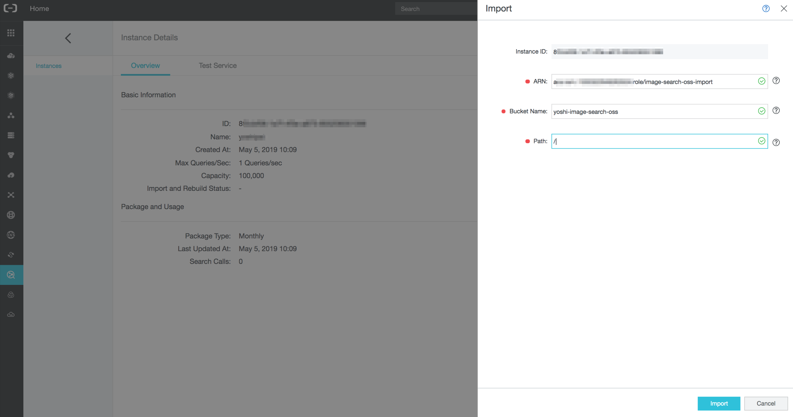

# Import many images from OSS to Image Search instance

## Summary

1. [Introduction](#introduction)
2. [Prerequisite](#prerequisite)
3. [Step 1 - Prepare a increment.meta file](#Step-1---Prepare-a-increment.meta-file)
4. [Step 2 - Configure a OSS import setting parameters on Image Search instance](#Step-2---Configure-a-OSS-import-setting-parameters-on-Image-Search-instance)
5. [Step 3 - Execute OSS import](#Step-3---Execute-OSS-import)
6. [Support](#support)


## Introduction

The goal of this tutorial is to explain how to import a large amount of image files from [OSS](https://www.alibabacloud.com/help/product/31815.htm) to [Image Search](https://www.alibabacloud.com/help/product/66413.htm) instance. OSS is a storage service and Image Search is an intelligent image service based on deep learning and machine learning technology on Alibaba Cloud. This tutorial helps you to prepare a configuration file and some setting parameters to execute OSS import on Image Search instance.


## Prerequiste

### Local environment

* npm

* Node.js

In this tutorial, we use a tool to create a configuration file efficiently. To run it, you have to install [npm](https://github.com/npm/cli) and [Node.js](https://nodejs.org/) on your local machine. Please install them if you don't have.

You can check your environment with the following commands in a terminal:
```bash
# Check that npm is installed
npm -v

# Check that node is installed
node -v
```

### Alibaba Cloud

0. Alibaba cloud account

    You need an Alibaba cloud account. If you don't have any account, please follow
    [this document to create one](https://www.alibabacloud.com/help/doc-detail/50482.htm).

1. Create an access key

    You need an accessKeyId and an accessKeySecret. If you don't have any access key, Please follow
    [this document to obtain an access key id and secret](https://www.alibabacloud.com/help/faq-detail/63482.htm).

2. Image Search instance

    You need an image search instance. If you don't have any Image Search instance, please follow [this document to create one](https://www.alibabacloud.com/help/doc-detail/66569.htm).

3. OSS bucket

    You need an OSS bucket which contains image files. If you don't have any OSS bucket with image files, please follow [this document to create one](https://www.alibabacloud.com/help/doc-detail/31886.htm) to upload images. Please note **your Image Search instance and OSS must be in the same region**.


## Step 1 - Prepare a increment.meta file

To import image files from OSS to Image Search instance, you have to create a configuration file called [incremant.meta](https://www.alibabacloud.com/help/doc-detail/66580.htm#h3-import-images). The file contains image list with import properties.

1. Clone this repository

2. Build the tool

    First, initialize the tool by running the following commands in a terminal:

    ```bash
    cd tool/app/server
    npm run init
    ```

3. Start a server of the tool

    Then, start a server by running the following command in a terminal:

    ```bash
    npm run start
    ```

4. Use the tool

    1. Access to http://localhost:3000.

    2. Input your credentials to the form.

        * accessKeyId : The access key if of your Alibaba Cloud account

        * accessKeySecret : The access secret if of your Alibaba Cloud account

        * OSS region : The region of your OSS bucket

        * OSS bucket : The name of your OSS bucket

        * OSS bucket folder : the OSS bucket folder path which contains your images. By default, this tool get all images in the specified OSS bucket and put them into the list in increment.meta file. If you want to select an OSS bucket folder to filter the list, you can specify it.

        You can check OSS region and bucket name from [OSS console](https://oss.console.aliyun.com/overview).

        

    3. Submit the form to get the image list in your bucket.

    4. Check the image list.

        To preview your images, please set [ACL](https://www.alibabacloud.com/help/doc-detail/100676.htm) of the images to *Public Read*. Select a [category](https://www.alibabacloud.com/help/doc-detail/66623.htm) for each image if you want.

    5. Click a download link at the bottom.

        The increment.meta file will be downloaded.

        

5. Stop the server of the tool

    After you get the increment.meta file, stop the server by press Ctrl + c in a terminal.

6. Put the increment.meta file

    Put the increment.meta file you created at previous step into every OSS bucket folder which contains the images you want to import to Image search instance.

    
    


## Step 2 - Configure a OSS import setting parameters on Image Search instance

First, click the *Import* button at right-top corner.


Then, a menu appears which has input boxes of setting parameters that you have to prepare for OSS import.


* ARN

    You have to give some permissions to the Image Search instance. Please create a RAM role and input the ARN parameter.

    1. Access to [RAM Roles management console](https://ram.console.aliyun.com/roles).

    2. Create a RAM role.

        1. Click Create RAM Role button.

        2. Select a type as **Alibaba Cloud Service** and trusted service as **Image Search**.

            
        
        3. Input a RAM Role Name. For example, *Image-Search-OSS-import*.

        4. Click *OK* button.

    3. Add permissions to a RAM role.

        1. Search a RAM role you created and click *Add Permissions* button.

            

        2. Add Permissions.

            1. Search policy of **AliyunOSSReadOnlyAccess** and select it.

                

            2. Do same for **AliyunImageSearchFullAccess**.

            3. Click *OK* button.

    4. Get ARN.

        1. Open the role details of a RAM role you created.

            

        2. Copy ARN and paste it to ImageSearch instance OSS import parameter input box.

            

* Bucket Name

    Check the bucket name which contains your images from [OSS console](https://oss.console.aliyun.com/overview), and input the name to ImageSearch instance OSS import parameter input box.

* Path

    It represents the OSS bucket folder path. Check the bucket folder path which contains your images in your OSS bucket, and input the path to ImageSearch instance OSS import parameter input box. It must start with "/", for example "/bag". You have to input "/" if you put your images on root.


## Step 3 - Execute OSS import

After the configuration, click the *Import* button to execute OSS import. You can see your import history by click *Show Import History*.


Please note that **OSS import can be executed to only one OSS bucket folder by once**. The images listed in increment.meta file which are not in the specified *Path* parameter will be ignored. If you want to import from multiple folders in OSS bucket, you have to change *Path* parameter and execute for each folder.


## Support

Don't hesitate to [contact us](mailto:projectdelivery@alibabacloud.com) if you have questions or remarks.
